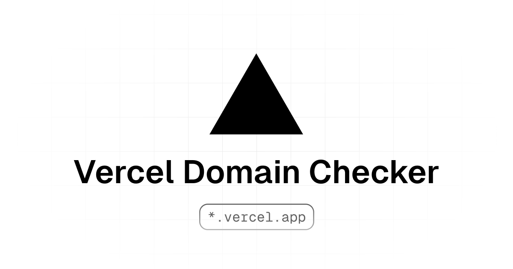

# Vercel Domain Checker

A simple site to check if a domain is available on Vercel. Just type an app name, and it will check if its .vercel.app domain is available.

If you have any suggestions, feel free to open an issue or a pull request, and send me a DM on 𝕏!

## Tech Stack

- Next.js 14
- Tailwind CSS
- TypeScript
- Shadcn/ui
- Vercel Edge Function
- Geist Font
- Sonner
